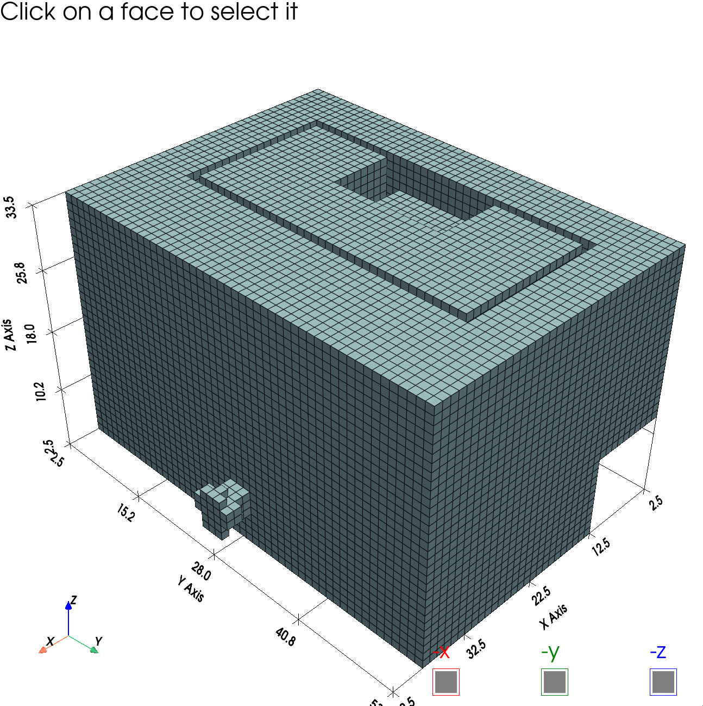
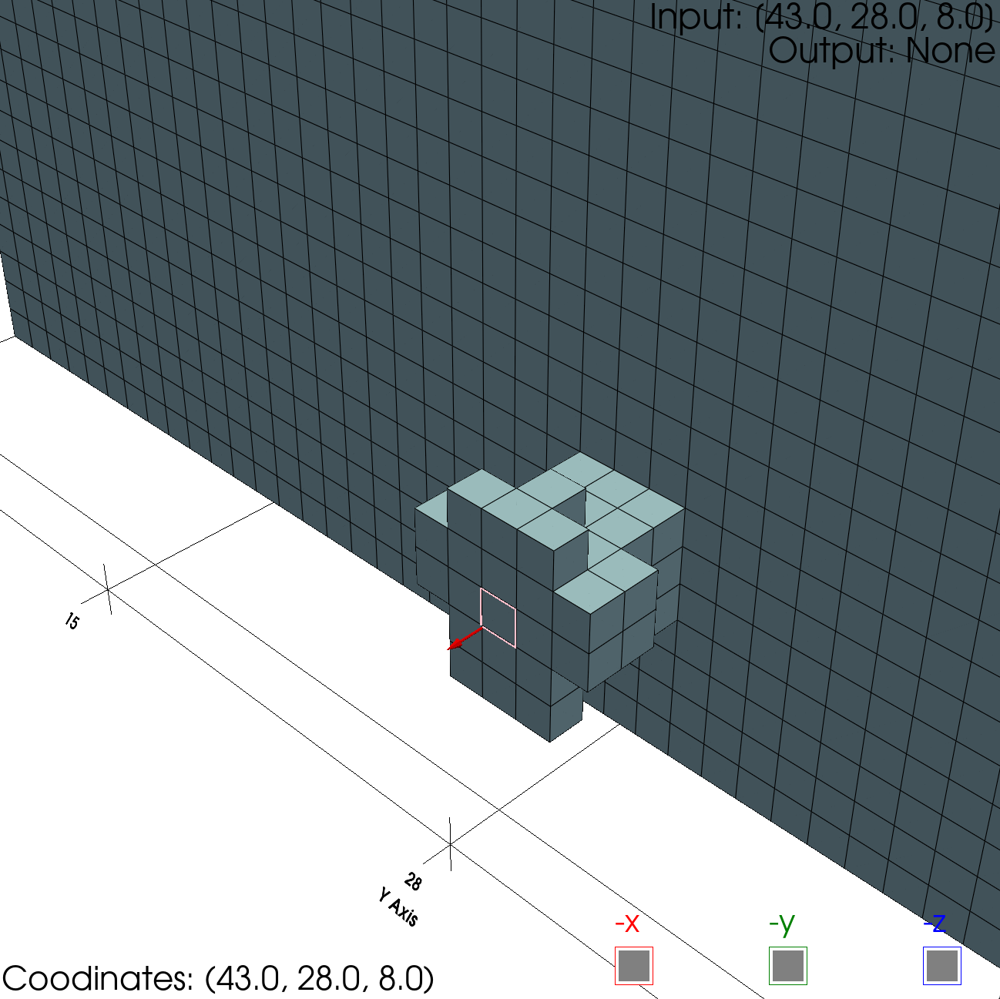
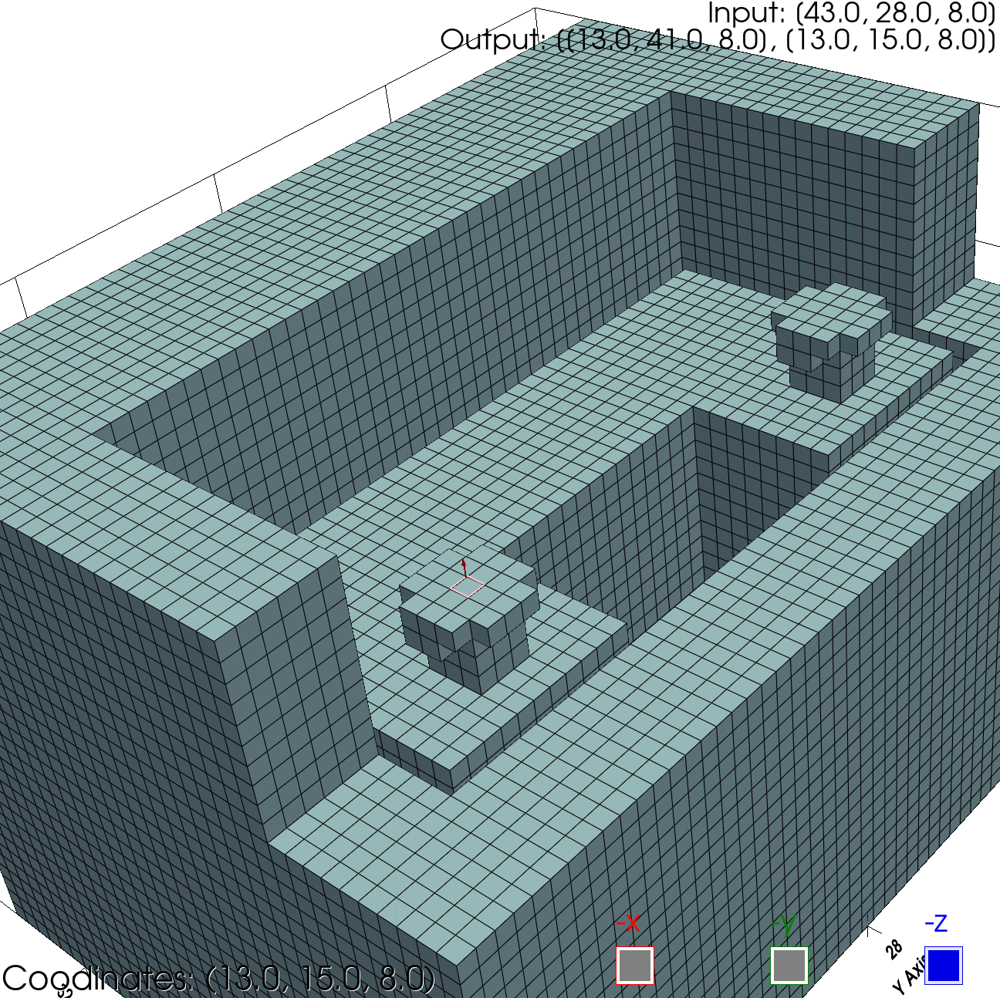

# Pathfinder CLI - User Guide

# Table of Contents

## Pathfinder CLI - User Guide

1. [Overview](#overview)
2. [Installation](#installation)
3. [Running the Program](#running-the-program)
4. [Usage](#usage)
   - [Commands](#commands)
   - [Workflow](#workflow)
   - [Note](#note)
5. [Conclusion](#conclusion)

## Voxel Model Visualization with PyVista - Installation and Running Instructions for Plotter.py

1. [Overview](#overview-1)
2. [Installation](#installation-1)
3. [Running the Visualization Tool](#running-the-visualization-tool)
4. [Conclusion](#conclusion-1)

## Overview

The Pathfinder CLI is a command-line interface program for finding the shortest path between two points in a 3D model represented as an STL file. It uses the Dijkstra algorithm to calculate the shortest path and provides information about the number of L joints, T joints, and piping segments in the pipeline.

## Installation

1. Clone or download the entire "Pathfinder" repository from GitHub.

2. Install the required Python packages using pip. Open a terminal or command prompt, navigate to the "Pathfinder" directory, and run the following command:

```bash
pip install -r requirements.txt
```

3. Make sure you have Python 3.6 or higher installed on your system.

## Running the Program

To run the Pathfinder CLI, follow these steps:

1. Open a terminal or command prompt.

2. Navigate to the "Pathfinder" directory.

3. Run the following command to start the CLI:

```bash
python pathfinder.py
```

## Usage

### Commands

The following commands are available in the Pathfinder CLI:

- `setres`: Set the resolution for voxelization. Leave empty to use the default value (0.05). Recommended resolution is 0.05 and must be between 0 and 1. Must be set before loading a model.

- `loadmodel`: Load a 3D model from an STL file and voxelize it. Currently, only STL files are supported. Must be loaded before picking input and output coordinates.

- `pickio`: Pick input and output coordinates. Must be done after loading a model. Click on a face to select it. Press the relevant checkbox to ensure correct coordinates are selected. The arrow MUST be visible and facing away from the selected face. Press 'i' to select input coordinates. Press 'o' to select output coordinates. Press 'c' to clear selection. Press 'q' to exit selection mode.

- `setinput`: Set input coordinates manually (not recommended). Provide the input coordinates as "x,y,z".

- `setoutput`: Set output coordinates manually (not recommended). Provide the output coordinates as "x1,y1,z1,x2,y2,z2,...".

- `standardlength`: Set the standard length of pipe in millimeters (mm). Must be set before running the algorithm. If not set, the total length of pipe to purchase will be provided instead. If set, the number of standard lengths of pipe required will be provided instead. The standard length of pipe must be greater than 0.

- `run`: Run the algorithm to find the shortest path and calculate the number of joints and segments in the pipeline. Must be run after setting input and output coordinates. Must be run after setting the standard length of the pipe (optional).

- `generatereport`: Generate a report with results and images of the pipeline. Must be run after running the algorithm. The report will be generated in the same directory as the program. The report will contain results and images of the pipeline. The report will be generated in PDF format if MikTeX is installed. Otherwise, it will be generated in Word format.

- `help`: Display available commands and their usage.

- `exit`: Exit the program.

### Workflow

Follow these steps to use the Pathfinder CLI:

1. Set the resolution for voxelization (optional). Use the `setres` command to set the resolution for voxelization. Leave empty to use the default value (0.05).

2. Load a 3D model. Use the `loadmodel` command to load a 3D model from an STL file. Currently, only STL files are supported. The model must be loaded before picking input and output coordinates.

3. Pick input and output coordinates. Use the `pickio` command to interactively pick input and output coordinates from the loaded model. Click on a face to select it. Press the relevant checkbox to ensure correct coordinates are selected. The arrow MUST be visible and facing away from the selected face. Press 'i' to select input coordinates. Press 'o' to select output coordinates. Press 'c' to clear selection. Press 'q' to exit selection mode.

   - Picker UI:

     

   - Input Select Example:

     

   - Output Select Example:

     

4. Set input and output coordinates manually (optional). Alternatively, you can set input and output coordinates manually using the `setinput` and `setoutput` commands. Provide the coordinates as "x,y,z" for single points or "x1,y1,z1,x2,y2,z2,..." for multiple points.

5. Set the standard length of the pipe (optional). Use the `standardlength` command to set the standard length of the pipe in millimeters (mm). If not set, the total length of pipe to purchase will be provided in the report.

6. Run the algorithm. Use the `run` command to run the algorithm and find the shortest path between the input and output points. The algorithm will calculate the number of L joints, T joints, and piping segments in the pipeline.

7. Generate a report. Use the `generatereport` command to generate a report with the results and images of the pipeline. The report will be generated in the same directory as the program.

8. Exit the program. Use the `exit` command to exit the program.

### Note

- The images of the pipeline generated in the report are for reference only. The actual pipeline may differ from the images. Please refer to the number of L and T joints and the length of pipe required for the actual pipeline.

- The program makes certain assumptions in the calculation of the number of L and T joints and the length of pipe required. The assumptions are as follows:
  - The input and output points are the endpoints of the pipeline.
  - The input and output points are L joints.
  - There are no obstacles in the pipeline.

- The report will contain the following information:
  - Number of L joints
  - Number of T joints
  - Number of pipe segments
  - Length of pipe required
  - Number of standard lengths of pipe required (if the standard length of pipe is set) or the length of pipe to purchase (if the standard length of pipe is not set).

## Conclusion

The Pathfinder CLI provides a convenient way to find the shortest path between two points in a 3D model and calculate the number of joints and segments in the pipeline. It offers an interactive interface for picking input and output coordinates and generates a detailed report with the results and images of the pipeline.

# Voxel Model Visualization with PyVista - Installation and Running Instructions for Plotter.py

## Overview

This document provides instructions for installing and running the interactive Voxel Model Visualization tool, built using the PyVista library. The tool allows users to visualize 3D voxel models and interactively select input and output points.

## Installation

Before running the Voxel Model Visualization tool, ensure that you have the required dependencies installed on your system.

### 1. Python and pip

Make sure you have Python (version 3.7 or higher) and pip (Python package manager) installed on your system.

### 2. NumPy

The tool depends on NumPy for numerical computations. Install NumPy by running the following command:

```bash
pip install numpy
```

### 3. PyVista

PyVista is the main library used for interactive 3D visualization. Install PyVista by executing:

```bash
pip install pyvista
```

### 4. Optional Dependencies

If you want to run the Dijkstra's algorithm and other functions from the previous code provided, make sure you have the necessary dependencies installed. For example, if you are using Jupyter Notebook, you can install Matplotlib for plotting results:

```bash
pip install matplotlib
```

## Running the Visualization Tool

Once you have installed the required dependencies, you can run the interactive Voxel Model Visualization tool.

### 1. Download the Code

First, download or copy the entire code provided in the `Plotter` class section.

### 2. Import the Plotter Class

In your Python script or Jupyter Notebook, import the `Plotter` class by adding the following line at the beginning:

```python
import warnings
import numpy as np

with warnings.catch_warnings():
    warnings.filterwarnings("ignore", category=DeprecationWarning)
    import pyvista as pv
```

### 3. Create and Customize the Voxel Model

To use the `Plotter` class, you need to provide the voxel model (`vx`) and the points data (`pts`). Additionally, you can specify scalar values for voxel coloring using the `flat` parameter.

```python
# Example:
vx = ...  # Replace with your voxel model (pyvista.UniformGrid)
pts = ...  # Replace with your points data (numpy.ndarray)
flat = ...  # Replace with your scalar values (numpy.ndarray) or set to None if not used

# Create the Plotter object
plotter = Plotter(vx, pts, flat=flat)
```

### 4. Customize Plot Options (Optional)

You can customize the visualization by toggling grid lines and axes display using the parameters `grid` and `axes`. Additionally, enable or disable element picking for point selection using the `picker` parameter.

### 5. Run the Visualization

Finally, call the `plot()` method to display the interactive 3D visualization plot.

```python
# Example:
plotter.plot()
```

### 6. Interacting with the Visualization

Once the visualization is displayed, you can interact with it in the following ways:

- Select Input and Output Points: Click on the voxel faces to select input and output points. The selected points will be displayed in the plot.
- Toggle Axes and Grid: You can toggle the display of 3D axes and grid lines by setting the `axes` and `grid` parameters during the `Plotter` object initialization.
- Clear Selection: To clear the selected input and output points, press the 'c' key.
- Input and Output Information: Press the 'i' key to display the selected input point information, and the 'o' key to display the selected output point(s) information.

## Conclusion

The interactive Voxel Model Visualization tool provides an intuitive way to visualize 3D voxel models and interact with them in real-time. By following the installation and running instructions provided in this document, you can easily use the tool to explore and analyze your own voxel data. Happy visualizing!