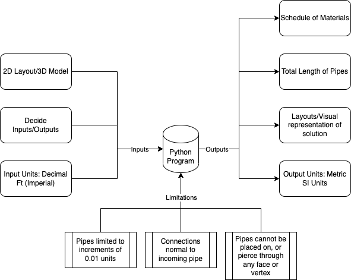

# Developer Coding Challenge - Pipeline Path Finder
> *Author: Rushabh Patel*

> *Date: 2023-07-22*

## Table of Contents
2. [Critical Assumptions](#critical-assumptions)
3. [Main CLI](#main-cli)
4. [Dijkstra Algorithm](#dijkstra-algorithm)
5. [Plotter](#plotter)
6. [Rationale for using a Voxel Representation](#rationale-for-using-a-voxel-representation)
7. [Rationale for using Dijkstra's Algorithm](#rationale-for-using-dijkstras-algorithm)
8. [Rationale for Pricing](#rationale-for-pricing)
9. [Future Work](#future-work)
10. [References](#references)

## Critical Assumptions

The challenge provided a 3D model and documentation containing geometry details, however, geometry details did not match the 3D model. Hence, 3D model was used as the source of truth for geometry details. As per the challenge description, the model units was assumed to be in Feet, which will be converted to SI units (mm) in the code. The following assumptions were made to complete this challenge:
- The model was also assumed to be in the first quadrant of the Cartesian coordinate system, with the origin at the bottom left corner of the model. 
- The model was also assumed to be a closed manifold, with no holes or gaps in the geometry. 
- The model was also assumed to be a single part, with no separate parts or components. 
- The input and output locations were marked on the STL file provided by protrusions (cones), and the coordinates were extracted from the STL file.
- The inputs and outputs were assumed to be on the surface of the protrusions, and not inside the model as the challenge description states.
- In an ideal case, the protrusions would not exist, and there would be holes on the wall of the model. However, the protrusions were added to the model to make it easier to select input and output locations.
- The centre of the protrusions was assumed to be the input and output locations.
- The diameter of the piping was assumed to be 15mm (which is approximately the size of the voxel at the default resolution of 0.05) for cost calculation.
- The piping was assumed to be made of copper for cost calculation.
- The piping is attached to the input and output locations using L-joints. 
- The size of voxel (mm/voxel) was calculated using the model's width in y-axis.

Based on these assumptions, a Python program can be developed to find the shortest path between the input and output locations. The flow chart shown in Figure 1 illustrates the overall process of the pipeline path finder application.

## Main CLI

The code provided is a Python script that serves as a Command Line Interface (CLI) for a Pathfinder application. It allows users to load 3D models, voxelizes them, pick input and output coordinates from the models, run the Dijkstra algorithm to find the shortest path between input and output points, and generate a report containing the results and images of the pipeline.

A break down of the underlying process behind this code:

1. **Importing Libraries**: The code begins by importing several Python libraries, including `sys`, `os`, `numpy`, `trimesh`, `PVGeo`, `warnings`, `math`, `mdutils`, `pypandoc`, `plotter`, and a custom module `dijkstra`.

2. **Defining Helper Functions**: The script defines various helper functions to perform specific tasks, such as:
   - `coord_array`: Converts a 3D array of coordinates into a more readable format.
   - `calculate_direction_changes`: Calculates the number of direction changes in each path provided.
   - `joints_calc`: Calculates the number of L joints, T joints, and piping segments based on the direction change data and input/output locations.
   - `load_file`: Loads an STL file, voxelizes it, and returns the voxelized points, voxel grid, and voxel size.
   - `assign_input_loc`: Assigns the input coordinates globally for later use.
   - `assign_output_loc`: Assigns the output coordinates globally for later use.
   - `pPlotter`: A class to provide plotting functionality for the voxelized points and the point cloud data.

3. **Command-Line Interface (CLI)**: The script enters the main loop of the CLI. It repeatedly prompts the user for commands, processes the commands, and provides corresponding functionalities. The available commands include `setres`, `loadmodel`, `pickio`, `setinput`, `setoutput`, `standardlength`, `run`, `generatereport`, `help`, and `exit`.

4. **Interaction with 3D Models**: The script enables the user to load 3D models in STL format, visualize them using a plotter, and pick input and output coordinates from the loaded model by clicking on the faces. The selected coordinates are stored and used in the later stages of the pipeline calculation.

5. **Pipeline Calculation**: After the input and output coordinates are selected, the Dijkstra algorithm is applied to find the shortest paths between them in the voxelized space. The number of L joints, T joints, and piping segments are calculated based on the direction changes in each path. The length of pipe required and the number of standard lengths (if set) are also determined.

6. **Generating Reports**: Once the pipeline calculation is completed, the script provides an option to generate a report. The report contains the results of the pipeline calculation, such as the number of joints, pipe segments, pipe length, and standard lengths (if set). It also includes images of the pipeline from different angles.

7. **Exiting the Program**: The script provides an option to exit the program when the user enters the `exit` command.

Overall, the script serves as a useful CLI tool to interactively analyze 3D models, calculate pipeline paths, and generate informative reports based on the results.

## Dijkstra Algorithm

The provided implements Dijkstra's algorithm in 3D to find the shortest path between two nodes in a 3D grid. It is based on an already existing code that was implemented in 2D [1]. Hence a complete overhaul was required to add the necessary computation for 3-Dimensional mathematics. Let's break down the underlying process and how the code achieves it:

1. Defining Helper Functions:
   The code begins by defining several helper functions:
   - `valid_node(node, size_of_grid)`: Checks if a given node is a valid node within the specified grid.
   - `x_up(node)`, `x_down(node)`, `y_up(node)`, `y_down(node)`, `z_up(node)`, `z_down(node)`: Return the nodes above, below, right, left, in front of, and behind a given node, respectively.

2. The `backtrack` Function:
   This function backtracks the path from the desired node to the initial node based on the calculated distances. It starts from the desired node and iteratively moves back through nodes with decreasing distances until reaching the initial node. The function returns a list of nodes representing the shortest path.

3. The `dijkstra` Function:
   This is the main function that implements Dijkstra's algorithm. It takes three arguments:
   - `initial_node`: The initial node in the grid.
   - `desired_node`: The desired node in the grid (coordinates as [x, y, z]).
   - `obstacles`: A list of obstacles in the grid.

   The function converts the obstacles to a large value (1000) and adds 1 to ensure that obstacles are avoided while calculating the shortest path. It then initializes distances from the `initial_node` to all other nodes as infinity and explores adjacent nodes, updating their distances if a shorter path is found. The `visited` array is used to track visited nodes and avoid revisiting them.

4. Dijkstra's Algorithm:
   The algorithm starts with the `current_node` set to the `initial_node`. It iteratively explores the neighbors of the `current_node`, updating the distances and marking the nodes as visited until the `desired_node` is reached. The algorithm terminates when the `current_node` becomes the `desired_node`.

5. Return and Print:
   The function returns the shortest path as a list of nodes using the `backtrack` function. The code also prints the number of iterations (steps) taken by the algorithm to find the shortest path.

It's worth noting that the algorithm uses a 3D numpy array to represent the grid, and each element in the array corresponds to a node in the grid. Obstacles are represented by large values in the array to ensure they are avoided during path calculation.

To use this code, you can call the `dijkstra` function with appropriate `initial_node`, `desired_node`, and `obstacles` arguments. The function will return the shortest path between the initial and desired nodes as a list of nodes.

Upon conducting further research, I was able to find an existing research article that implements Dijkstra's algorithm in 3D [2]. The article provides a detailed explanation of the algorithm and its implementation in 3D and application in CAD for piping route in a power plant. 

## Plotter

The provided code defines a `Plotter` class that facilitates interactive visualization of voxel models using the `pyvista` library. The class provides an environment for users to interactively select input and output points, toggle grid lines, and view 3D axes. Let's break down the underlying thought process of developing this code: 

1. Importing Required Libraries:
   The code starts by importing the necessary libraries, including `warnings` and `numpy`. Notably, it uses `pyvista` for interactive 3D plotting.

2. Suppressing Deprecation Warnings:
   The code uses `warnings.catch_warnings()` to temporarily suppress any deprecation warnings that might arise from `pyvista`.

3. The `Plotter` Class:
   The `Plotter` class is defined to handle interactive visualization of voxel models. The class is designed to work with `pyvista.UniformGrid`, representing the voxel model, and a numpy array `pts` containing points of interest in the voxel model. It also optionally supports a `flat` array to provide scalar values for coloring the voxels.

4. Initializing the `Plotter` Object:
   The `__init__` method is used to initialize the `Plotter` object. The user can specify various attributes such as the `vx` (voxel model), `pts` (points of interest), `flat` (scalar values for coloring), `picker` (enable interactive element picking), `grid` (display grid lines), and `axes` (display 3D axes).

5. Configuring the Plot:
   Within the `__init__` method, the code configures the 3D plot environment using `pyvista`. It sets up the plot window size, adds the voxel model to the plot with specified properties (color, edges, and scalar values), and optionally displays grid lines and axes. If interactive element picking is enabled (`picker=True`), additional interactive elements are added to the plot, such as checkboxes, text, and key event callbacks.

6. Interactive Element Picking:
   Interactive element picking allows users to interact with the 3D plot by selecting voxel faces. The callback functions, such as `callback_i` and `callback_o`, handle user interactions when pressing the 'i' and 'o' keys to select input and output points, respectively. The `callback` function is responsible for handling the interactive element picking and updating the plot accordingly.

7. Additional Helper Functions:
   The class also provides additional helper functions to retrieve selected input and output points (`get_i` and `get_o`), handle checkbox widget callbacks (`callback_negx`, `callback_negy`, `callback_negz`), and clear selected points (`clear_sel`).

8. Customization and Extensibility:
   The class allows for customization and extensibility through its methods. For example, users can add parts to the plot using `add_part` and update the x, y, and z-coordinates of selected points using `update_x`, `update_y`, and `update_z`, respectively.

9. Displaying the Plot:
   The `plot` method is used to display the 3D plot with all the specified elements and configurations.

Overall, the underlying thought process behind developing this `Plotter` class is to create an interactive visualization tool that makes it easy for users to explore and interact with voxel models. It utilizes the `pyvista` library's capabilities to render 3D plots and provides a user-friendly environment for selecting input and output points within the voxel model. Additionally, the class is designed to handle various customization options to enhance the user experience while visualizing voxel data. I used my previous experience in medical imaging to develop this class, which allowed me to leverage the advantages of voxel models to create a practical solution for the pipeline path finder application.

## Rationale for using a Voxel Representation

The rationale for using a voxel model lies in its ability to represent and analyze three-dimensional data in a discrete and structured manner. Voxel models are widely used in various fields due to their unique advantages:

1. **3D Representation**: Voxel models are well-suited for representing complex three-dimensional structures and data. Each voxel represents a small volume element (3D pixel) in space, and together, they form a grid-like structure that covers the entire volume. This grid structure naturally aligns with the spatial layout of the data.

2. **Spatial Information**: Voxel models maintain spatial information, making them ideal for tasks that require precise spatial relationships and measurements. They are commonly used in medical imaging (e.g., CT scans, MRI) to represent the internal structures of the human body, as well as in geological modeling and other scientific simulations.

3. **Flexibility and Uniformity**: Voxel models provide a uniform representation, where each voxel has a consistent size and shape. This uniformity simplifies data processing, analysis, and visualization algorithms, as they can be applied uniformly to all voxels.

4. **Easy Integration with Algorithms**: Many algorithms and methods are specifically designed for voxel data, enabling efficient processing and analysis. For example, techniques like ray tracing, volume rendering, and voxel-based simulations are directly applicable to voxel models.

5. **Voxel Attributes**: Voxel models can store additional attributes (e.g., scalar values, material properties) within each voxel, making them suitable for representing continuous or discrete information at specific points in 3D space.

6. **Interactivity and Visualization**: Voxel models lend themselves well to interactive 3D visualization, allowing users to explore and interact with the data in a natural way. This makes voxel models useful in fields like computer graphics, virtual reality, and computer-aided design (CAD).

7. **Medical and Scientific Applications**: In medical imaging, voxel models enable detailed representations of anatomical structures, facilitating accurate diagnoses and treatment planning. Additionally, in scientific simulations, voxel models are used to model physical phenomena in three-dimensional space.

8. **Data Conversion**: Voxel models can often be generated or derived from other types of 3D data representations, such as point clouds or surface meshes. This conversion enables data interoperability and the use of specialized voxel-based algorithms.

Despite their advantages, voxel models also have some limitations:

- **Storage and Memory Requirements**: Voxel models can consume a significant amount of memory, especially for high-resolution or large 3D datasets, which may pose challenges for memory-limited systems.

- **Discretization Artifacts**: Voxel models inherently suffer from discretization artifacts, especially when the voxel size is relatively large compared to the data details. Smaller voxels can mitigate this issue, but it comes at the cost of increased memory requirements.

- **Complex Geometry**: For representing highly detailed and complex geometries, voxel models may require an impractical number of voxels, leading to increased computational costs.

Overall, the rationale for using a voxel model depends on the specific requirements of the application. When precise spatial information and volumetric data representation are essential, voxel models offer a practical and efficient solution. They are particularly valuable in fields such as medical imaging, scientific simulations, computer graphics, and any domain where a structured 3D representation is advantageous. Using my previous experience in medical imaging, I was able to leverage the advantages of voxel models to develop a practical solution for the pipeline path finder application. However, there are some considerations such as discretization artifacts (i.e. voxel size vs. model details).

## Rationale for using Dijkstra's Algorithm

The rationale for using Dijkstra's algorithm lies in its ability to find the shortest path between two nodes in a graph. It is a well-known algorithm that has been widely used in various fields, including computer science, mathematics, and engineering. It is also relatively simple to implement and has a low computational complexity, making it suitable for real-time applications. While the are other algorithms, such as A* (A-star), which may be more efficient in some cases, Dijkstra's algorithm is a good choice for this application due to its simplicity. My previous experience in developing 3D spacial algorithms also helped me to leverage the advantages of Dijkstra's algorithm to develop a practical solution for the pipeline path finder application. I have previously developed random-walk algorithm in 3D space with dynamic probabilities that affected the direction of the walk based on the properties of the surrounding voxels. This algorithm was used to simulate the diffusion of particles in 3D space.

To analyze the time complexity of the given code, let's break down the major parts:

1. **Initialization**: The function initializes arrays for `distances`, `visited`, and other variables. These initializations take constant time and do not depend on the input size.

2. **Main Loop (Dijkstra's Algorithm)**: The primary loop of the Dijkstra's algorithm iterates through nodes in the 3D grid. For each node, it examines its neighbors (up to six directions) and updates their distances if a shorter path is found. The loop stops when the desired node is reached.

   - The number of iterations in this loop depends on the size of the grid and the path's complexity.
   - For each iteration, the function checks six potential neighbors and updates their distances. Both of these operations take constant time.
   - In the worst case, the function might visit all nodes in the grid (when the desired node is far away or unreachable).

3. **Backtracking**: The function performs backtracking to construct the shortest path from the initial node to the desired node based on the calculated distances. Backtracking involves traversing the shortest path in reverse, starting from the desired node and backtracking through nodes with decreasing distances until reaching the initial node. This step's time complexity is proportional to the length of the shortest path.

Considering the above points, the time complexity of the Dijkstra's algorithm part (including the main loop) can be approximated as follows:

- If `N` is the total number of nodes (voxels) in the 3D grid, the main loop has a time complexity of approximately O(N). In the worst case, where all nodes are visited, this part dominates the overall time complexity.

- The backtracking step has a time complexity of O(k), where `k` is the number of nodes in the shortest path. This is a linear operation with respect to the length of the shortest path.

Overall, the time complexity of the entire code can be approximated as O(N + k), where `N` is the number of nodes in the 3D grid, and `k` is the number of nodes in the shortest path between the initial and desired nodes.

Keep in mind that the actual performance of the code will also depend on factors such as the size of the grid, the structure of the obstacles, and the efficiency of the Python interpreter. The time complexity analysis provides an estimate of the code's performance relative to the input size.

## Rationale for Pricing

The pricing for the pipeline path finder application is based on the following factors:

1. The piping is made of copper.

2. The piping is 15mm in diameter.

3. The unit cost of piping is $9.90 per meter [3].

4. The unit cost of L joints is $2.75 per joint [4].

5. The unit cost of T joints is $1.43 per joint [5].

## Future Work
1. **Implement A* Algorithm**: The A* algorithm is an extension of Dijkstra's algorithm that uses heuristics to improve performance. It is more efficient than Dijkstra's algorithm in many cases, especially when the shortest path is relatively short. Implementing the A* algorithm would be a good way to improve the performance of the pipeline path finder application.

2. **Improve piping computation**: The current implementation of the piping computation is relatively simple and does not take into account the certain edge-cases (e.g. where one path fully coincides the other). It would be interesting to explore more advanced techniques for calculating the number of joints, pipe segments, and standard lengths.

3. **Implement a GUI**: The current implementation of the pipeline path finder application is a command-line interface (CLI). While this is a good way to interact with the application, it would be more user-friendly to implement a graphical user interface (GUI) using a Python GUI library such as Tkinter or PyQt. This would allow users to interact with the application using a graphical interface instead of typing commands in the terminal.

4. **Improve Dijkstra Algorithm**: The current implementation of the Dijkstra algorithm is limited to one input and up to two outputs. It would be interesting to explore more advanced techniques for handling multiple inputs and outputs, where the algorithm can choose the best path based on certain criteria (e.g. shortest path, least number of joints, etc.) and can automatically decide the which input and output to use or which input and output to connect.

5. **Improve cost calculations**: The current value for the cost of the piping is based on the length of the pipes only. However, this can be further improved by find an average cost of piping based on diameter. The program can then be improved to ask user for the diameter of piping to be used, and calculate the cost based on the average cost of piping for that diameter *and* the length of the pipes. Conduct further research to obtain a better estimate of the cost of piping.

6. **Implement a non-voxel or mesh-based approach**: The current implementation of the pipeline path finder application uses a voxel-based approach to represent the 3D model. However, it would be interesting to explore other approaches such as mesh-based or point cloud-based representations. This would allow the application to handle more complex geometries and provide more accurate results.

6. **Improve code to handle edge-cases**: The code can be further improved to handle edge-cases such as:
    1. **File Loading**: The code loads an STL file for voxelization. Edge cases to consider here are:
        - The file loaded might not be an STL file or could be corrupt, causing unexpected behavior. Proper error handling and file format validation should be implemented.

    2. **Input and Output Coordinates**: The code allows the user to set input and output coordinates interactively or manually. Edge cases to consider are:
        - The input and output coordinates selected might be outside the voxel grid's boundaries. The code should validate that the provided coordinates are within the bounds of the grid and handle out-of-bound cases accordingly.

    3. **Resolution Setting**: The code allows the user to set the resolution for voxelization. Edge cases to consider are:
        - The resolution setting might be done after loading a model. If this happens, the code should inform the user that they need to reload the model to apply the new resolution setting.

    4. **Pipeline Calculation**: The code uses the Dijkstra algorithm to find the shortest path and calculates the number of L joints, T joints, and pipe segments. Edge cases to consider are:
        - The number of paths between the input and output coordinates could be more than two, which the code currently doesn't handle. The code should be updated to handle multiple paths between the input and output points properly.
        - The code assumes specific conditions for L joints, T joints, and endpoints. If these assumptions are not met, the algorithm's results might be incorrect. The code should be updated to handle various joint types and endpoint conditions.

    5. **Obstacle Handling**: The code currently represents obstacles as '1' in the voxel grid. If obstacles are represented differently or if there are multiple types of obstacles, the code should be modified to handle different obstacle representations correctly.

By addressing these edge cases, the code can provide a more robust and reliable Command Line Interface (CLI) for the Pathfinder application.

## References

[1] Fredenslund, L. L., Dijkstra’s Algorithm for Grids in Python, n.d., https://lunalux.io/dijkstras-algorithm-for-grids-in-python/ 

[2] Y. Yamada, Y. Teraoka, An optimal design of piping route in a CAD system for power plant,
Computers & Mathematics with Applications, Volume 35, Issue 6, 1998, Pages 137-149, ISSN 0898-1221, https://doi.org/10.1016/S0898-1221(98)00025-X.

[3] Smart Water, Copper tubing 15mm, n.d., https://smart-water.com.au/product/copper-tubing-per-meter 

[4] Plumbing Sales, 15mm Elbow 90 Deg Water Copper Press 1/2", n.d., https://plumbingsales.com.au/copper-tube-fittings/kempress-water/elbows-kempress-water/15mm-elbow-90-degree-f-f-kempress-water.html

[5] Plumbing Sales, 15mm 1/2" Copper Tee Equal Capillary W24, n.d., https://plumbingsales.com.au/copper-tube-fittings/copper-capillary-fittings/copper-tees/15mm-1-2-copper-tee-equal-capillary-w24.html